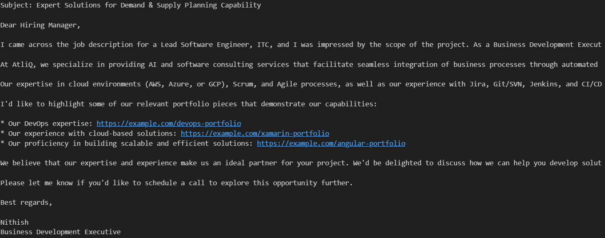

# Cold-Email-Generator

# 🎯 Project Purpose
To streamline and automate the inter-company talent sharing process between partner organizations in the IT sector through an AI-powered email communication system.

## ❗ Problem Statement
Currently, HR and Talent Acquisition teams face several challenges when manually crafting emails to share candidate profiles with partner companies:

### ⏳ Time Inefficiency:
- Manual composition of candidate recommendation emails is time-consuming.
- Significant effort required to review and match candidates with partner requirements.
- Delayed response time in sharing potential candidates.

### 📉 Quality Inconsistency:
- Varying email quality depending on the writer.
- Risk of missing key technical competencies in communications.

### 🏢 Resource Allocation:
- HR personnel spending excessive time on repetitive writing tasks.
- Reduced focus on core recruitment activities.

## 💡 Solution Framework
An AI-powered email generation system that:

### 🛠️ Technical Implementation:
- Leverages advanced Language Models (OpenAI, Gemini, LLAMA 3.1).
- Integrates with existing candidate databases.
- Automates profile analysis and matching.

## 🔑 Key Features:
- Automatic scanning of candidate profiles against partner requirements.
- Intelligent matching of technical expertise with job specifications.
- Generation of professionally crafted, personalized emails.

## 📈 Business Benefits:
- Reduced time-to-refer candidates.
- Improved partner collaboration.
- Increased efficiency in talent sharing.

## 🚀 How to Run the App:
Run the `main.py` file present in the app folder (`app/main.py`) or run `Email_Generator.ipynb` file.  
**Note:** Obtain your GROQ API KEY from the GROQ website and set it in the `.env` file.

## 📊 Technical Workflow Architecture:
- **User Interface:** Streamlit-based web interface for HR personnel.
- **Input Mechanism:** Job opening URL/link submission.
- **Data Source:** Candidate profiles stored in `my_portfolio.csv` (demo dataset).

### 🔗 Vector Database Integration:
- **Process:** Conversion of candidate portfolios into embeddings.
- **Purpose:** Enable semantic search and matching capabilities.

### 📝 Job Description Processing:
- Automated parsing of job opening content.
- Conversion into vector representations.
- Storage of semantic features and requirements.

### ⚙️ Semantic Analysis Engine:
- **Technology Stack:** GROQ API with LLAMA 3.1 Language Model.
- Semantic comparison between job requirements and candidate profiles.
- Pattern recognition for skill matching.

### 👥 Candidate Selection Algorithm:
- Technical requirements alignment.
- Experience level compatibility.
- Skill set correspondence.
- Domain expertise matching.
  
**Output:** Curated list of best-matched candidate profiles.

### 📧 Email Generation System:
- **Framework:** LangChain prompt engineering.
- **Components:**
  - Professional email templates.
  - Dynamic content insertion.
  - Contextual formatting.

**Output:** Automated, professionally crafted referral emails.

## 📈 Results
### Email

## 📊 Data Flow:
`Copy Job Opening URL → Vector Embedding → Semantic Analysis → Candidate Matching → Email Generation`

## 📁 Project File Structure
project_root/ ├── my_portfolio.csv # Candidate portfolio database ├── Email_Generator.ipynb # Main implementation notebook ├── app/ │ ├── main.py # Application entry point │ └── resource/ └── vector_stores/ # Vector embeddings for text and queries

### 📂 Description of Key Components:
- **my_portfolio.csv:** This file contains the candidate portfolio database, serving as the input for the system.
- **Email_Generator.ipynb:** A Jupyter notebook for implementing and testing the email generation functionalities.
- **app/main.py:** The main Python script that acts as the entry point for running the application.
- **app/resource/:** This folder contains additional modules that support the main application, including:
  - **chains.py:** Contains the logic for prompt templates and email generation.
  - **utils.py:** Provides utility functions for data cleaning and preparation.
  - **portfolio.py:** Responsible for parsing candidate portfolio content.
- **vector_stores/:** A directory where vector embeddings for text and queries are stored, facilitating semantic search capabilities.

## ⚠️ Key Project Challenges:
- **Data Quality:** Inconsistent portfolio formats, Accuracy of skill matching.
- **Resource Management:** API cost optimization, Memory usage for vector operations.

## Best Feature:
If you want to know the details of this project and behind the scenes you can interact with this project with Email_IO Assistant:
[Email_io👍](https://hf.co/chat/assistant/672750072c4b702f7a21272f "Get Over to assistant✌️")
